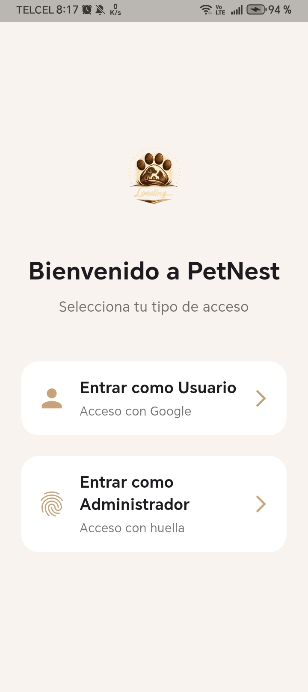
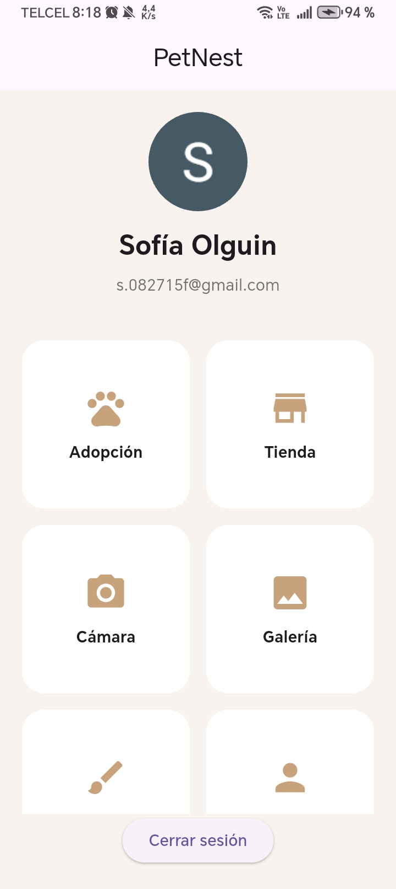
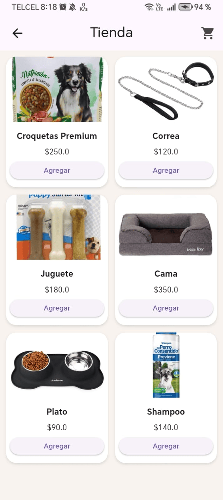
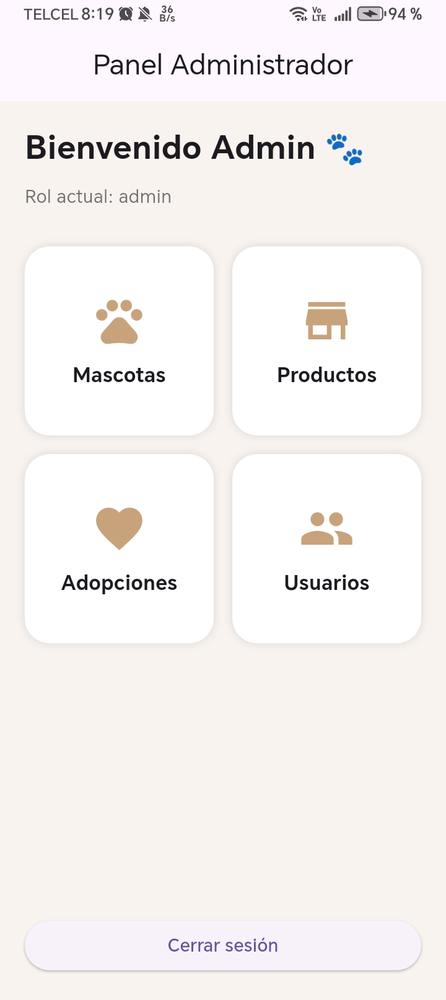

# 🐾 PetNest

PetNest es una aplicación móvil desarrollada en Flutter enfocada en el cuidado, adopción y gestión de mascotas.

La aplicación permite a los usuarios:
- Explorar mascotas disponibles para adopción
- Comprar productos para mascotas
- Administrar su perfil
- Gestionar información desde un panel administrador

---

# ✨ Funcionalidades

## 👤 Usuarios
- Inicio de sesión
- Registro de usuarios
- Perfil de usuario
- Cierre de sesión

## 🐶 Mascotas
- Visualización de mascotas
- Gestión de adopciones
- Información detallada

## 🛍️ Tienda
- Catálogo de productos
- Carrito de compras
- Recibo de compra

## 🛠️ Panel Administrador
- Gestión de mascotas
- Gestión de productos
- Gestión de usuarios
- Gestión de adopciones

## 📷 Funciones extra
- Cámara
- Galería
- Dibujo
- Enlaces rápidos

---

# 🚀 Tecnologías utilizadas

- Flutter
- Dart
- Firebase
- Provider
- Material Design

---

# 📱 Capturas

## Login


## Home


## Tienda


## Panel Admin


---

# 📂 Estructura del proyecto

```bash
lib/
 ├── data/
 ├── models/
 ├── providers/
 ├── screens/
 ├── services/
 ├── utils/
 ├── widgets/
 └── main.dart
